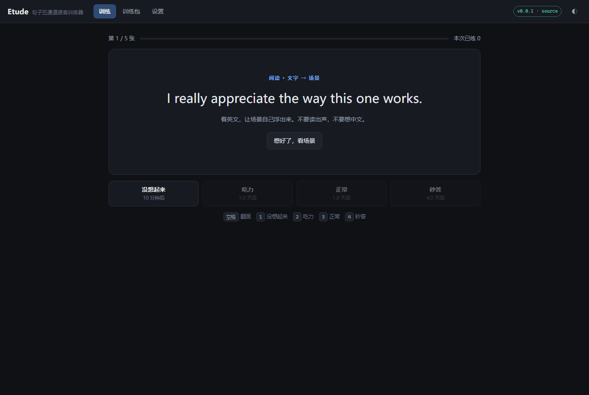
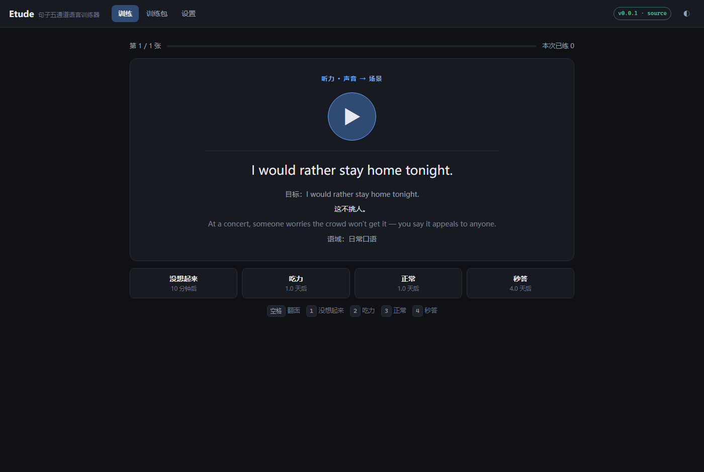
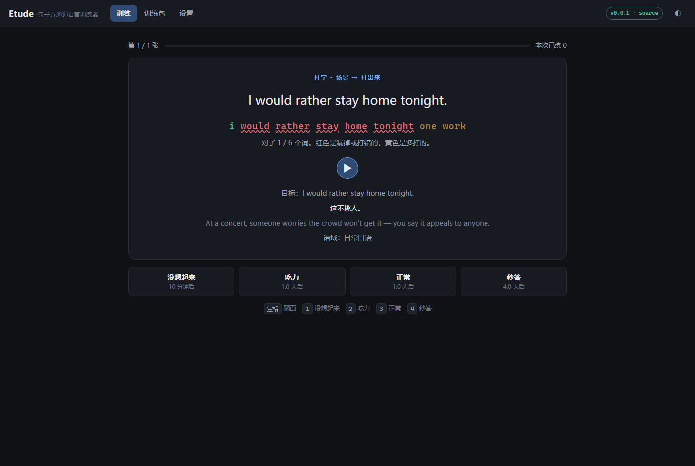
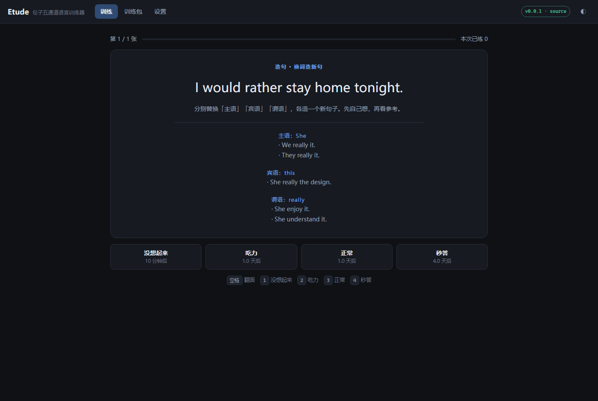
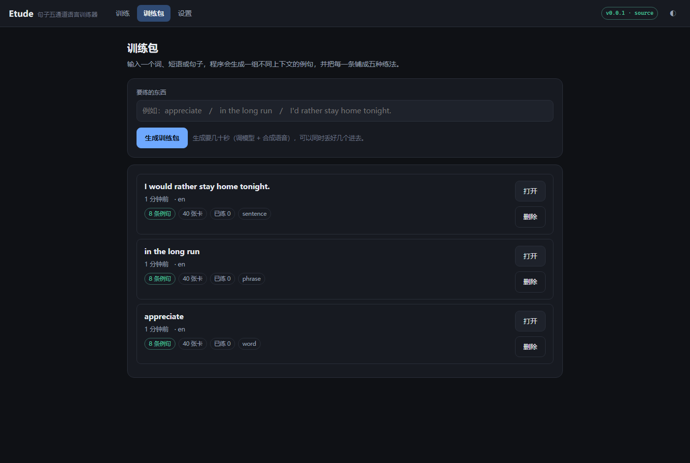
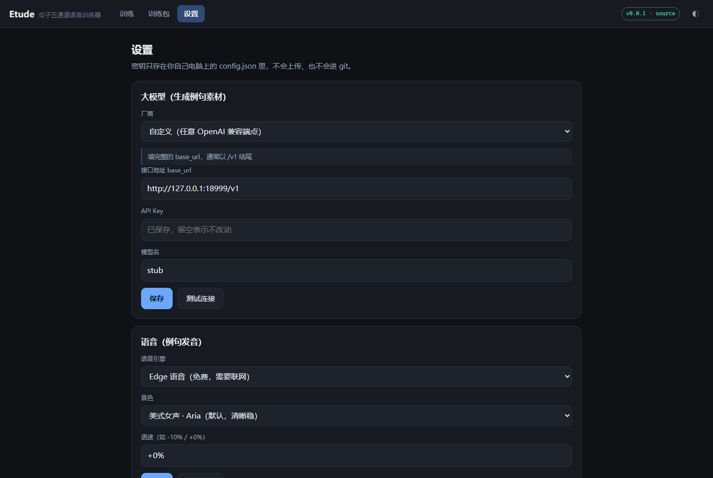

# Etude · 句子五通道语言训练器

> 一个把一句话练到「脱口而出」的本地工具。给它一个单词、短语或句子，
> 它生成一组**不同上下文**的例句，并把每一条铺成五种练法：阅读、听力、口语、打字、造句。
>
> 内容由大模型生成，语音由 Edge TTS 合成，复习进度存在你自己电脑上。
>
> *Etude*（/eɪˈtjuːd/）是音乐里的「练习曲」——**专为练技巧而写的曲子**，
> 不讲故事、不为演出，纯粹为了让手指形成本能。学语言是同一件事。

当前版本：**0.0.1**　·　目标语言：**英语**（其他语言见[路线图](#路线图)）

---

## 它和已有的工具不一样在哪

GitHub 上做「AI 生成语言卡片」的项目已经不少
（[mnemorai](https://github.com/StephanAkkerman/mnemorai)、
[han-flash](https://github.com/Baertig/han-flash)、
[anki_ai](https://github.com/gasparl/anki_ai)、
[anki-cards-ai-generator](https://github.com/ValeriiZhyla/anki-cards-ai-generator) 等）。

它们绝大多数是「**单词 → 卡片生成器**」——输入一个词，输出一张卡。Etude 不是一个造卡器，
它是一套**训练循环**，而且有几条明确的、和直觉相反的规矩：

| 常见做法 | Etude 的做法 | 为什么 |
|---|---|---|
| 一个词一张卡 | **一条例句五张卡**（听/说/读/写/造句） | 看得懂 ≠ 听得出 ≠ 说得出。合成一张卡等于假设它们能互相迁移。 |
| 卡片正面给中文翻译 | 正面给**场景**：「什么情况下会说这句话」 | 给逐字翻译的话，练习就变成了中译英——你在做翻译，不是在建立表达。 |
| 同一个中文解释反复出现 | 同一句话存 2~3 种**彼此不同**的中文说法，每次随机给一种 | 让大脑没法把英文锁死到某个固定中文上。 |
| 依赖 Anki + AnkiConnect（要先装插件、还得让 Anki 开着） | **自带训练器和间隔重复**，双击就能练 | 少一层依赖就少一处「配好了但没反应」。Anki 导出以后再说。 |
| 例句要你手动喂进去 | 给一个词，**自动生成 8 条不同上下文的句子** | 理论的要点是「用大量不同例子重塑连接」，凑例子是最费时间的一步。 |

这套规矩不是我编的，来自《学习观 07》——详细的理论到代码的映射见
**[docs/THEORY.md](docs/THEORY.md)**。

---

## 界面

<table>
<tr>
<td width="50%">

**阅读卡**：看英文，让场景自己浮出来
<br>

</td>
<td width="50%">

**听力卡**：只听声音，直接进入场景
<br>

</td>
</tr>
<tr>
<td width="50%">

**打字卡**：看场景打出来，逐词标出差异
<br>

</td>
<td width="50%">

**造句卡**：换掉主语/谓语/宾语造新句
<br>

</td>
</tr>
<tr>
<td width="50%">

**训练包**：一个词生成 8 条例句 × 5 种练法
<br>

</td>
<td width="50%">

**设置**：预置厂商 + 任意 OpenAI 兼容端点
<br>

</td>
</tr>
</table>

---

## 快速开始

### 方式一：下载 exe（不用装 Python）

1. 到 [Releases](https://github.com/whyao56/Etude/releases) 下载 `Etude-0.0.1-win64.zip`
2. **解压整个文件夹**，双击 `Etude.exe`
3. 打开后先去「设置」填大模型（见下一节）
4. 到「训练包」页，输入 `appreciate`，回车

> ⚠️ 不要只把 `Etude.exe` 单独拖出来运行。旁边的 `_internal` 文件夹是程序的一部分。

> 需要 Windows 10 1803+ / Windows 11。没有系统自带的 WebView2 时会自动改用浏览器打开，功能一样。

### 方式二：从源码跑

```bash
git clone https://github.com/whyao56/Etude.git
cd Etude/backend
python -m venv .venv && .venv/Scripts/activate
pip install -r requirements.txt
python run_etude.py
```

`--no-window` 只跑服务不开窗口；`--port 9000` 换端口；`--data-dir D:\etude` 换数据目录。

---

## 配置大模型

训练包的例句是模型生成的，所以**必须配一个模型**。选一家即可：

| 厂商 | base_url | 模型名 |
|---|---|---|
| DeepSeek | `https://api.deepseek.com/v1` | `deepseek-chat` |
| 通义千问（百炼） | `https://dashscope.aliyuncs.com/compatible-mode/v1` | `qwen-plus` |
| 智谱 GLM | `https://open.bigmodel.cn/api/paas/v4` | `glm-4-flash` |
| Kimi | `https://api.moonshot.cn/v1` | `moonshot-v1-32k` |
| 豆包（火山方舟） | `https://ark.cn-beijing.volces.com/api/v3` | 填你的**接入点 ID**（`ep-xxxx`） |
| OpenAI | `https://api.openai.com/v1` | `gpt-4o-mini` |
| 本地 Ollama | `http://localhost:11434/v1` | `qwen2.5:7b` |

在「设置」里选厂商（会自动填好 base_url 和模型名）、粘上 API Key，点「测试连接」。

**密钥只写在本机的 `%LOCALAPPDATA%\Etude\config.json` 里**，不上传、不进仓库、
也不会回传到界面（界面上那个输入框永远显示「已保存，留空表示不改动」）。

> **建议用指令遵循较强的模型。** 生成器要求严格 JSON 输出，并且对「场景不是翻译」
> 这条约束很敏感 —— 弱模型会偷懒给逐字翻译，那整套方法就退化成中译英了。

---

## 五种卡片怎么练

| 通道 | 正面给什么 | 你要做什么 | 翻面看什么 |
|---|---|---|---|
| **阅读** | 英文句子 | 在脑子里出现场景。**不读出声，不想中文** | 场景描述（随机一种中文说法） |
| **听力** | 只有声音 | 直接进入场景。**中间不经过图片和中文** | 原文 + 场景，并再读一遍 |
| **口语** | 场景描述 | **真的出声说出来** | 原文 + 语音对照 |
| **打字** | 场景描述 | 打出英文 | 逐词比对：绿色对、红色错/漏、黄色多打 |
| **造句** | 原句 + 换词提示 | 换掉主语/谓语/宾语，造一个新句子 | 参考替换词和例句 |

**快捷键**（训练页）：`空格` 翻面　`1` 没想起来　`2` 吃力　`3` 正常　`4` 秒答

评分只影响**间隔**，不影响对错。评「没想起来」会让这张卡 10 分钟后再出现一次，
而不是推到明天 —— 当次会话里就该再遇到它。

---

## 数据、备份与恢复

所有东西都在 **`%LOCALAPPDATA%\Etude`**：

```
Etude/
├── config.json      设置和 API Key
├── etude.sqlite3    训练包、例句、卡片、复习记录
├── audio/           例句语音（按内容命名，重复生成不会存两份）
├── logs/            自检结果和生成失败的记录
└── backups/         手动备份
```

- **换地方解压程序不会丢数据**，数据和程序目录完全分开。
- 「设置 → 备份数据库」会导出一个自洽的单文件备份。
  （不用复制主文件的方式：数据库开着 WAL，直接复制会丢掉还没落盘的部分，
  打开是好的、内容却是旧的。）
- **卸载** = 删掉程序文件夹 + 删掉上面这个目录。

---

## 出问题了怎么办

**第一站永远是自检。** 在命令行里跑：

```
Etude.exe --check
```

它会逐项告诉你：数据目录能不能写、界面文件在不在、数据库能不能查、
模型配没配、语音引擎在不在、窗口组件有没有。
加 `--check-deep` 还会真的连一次模型。

结果同时写在 `%LOCALAPPDATA%\Etude\logs\selfcheck.txt`。

| 现象 | 先看这里 |
|---|---|
| 双击没反应 | 命令行跑 `--check`。多半是少了什么，它会直说。 |
| 界面打开了但生成失败 | 报错里带着「下一步做什么」，照着做。常见的是密钥错（401）或模型名错（404）。 |
| 有例句但没有声音 | 训练包里点「补语音」。也可以换个音色再试 —— Edge 语音偶尔会短暂不可用。 |
| 版本号显示不对 | 大概率是端口上还留着一个旧进程。关掉所有 Etude 进程再开。 |
| 生成很慢或超时 | 8 条例句本来就要几十秒。可以在设置里调大超时，或换个更快的模型。 |

---

## 开发

```
etude/
├── backend/
│   ├── app/
│   │   ├── paths.py        ← 全项目唯一判断「是不是在 exe 里」的地方
│   │   ├── prompts.py      ← 理论落到提示词的那一层（很重要）
│   │   ├── pipeline.py     ← 生成流水线
│   │   ├── providers/      ← 大模型与语音接入
│   │   ├── srs.py          ← 间隔重复（纯函数，好测）
│   │   ├── selfcheck.py    ← 自检
│   │   └── api.py          ← HTTP 接口
│   ├── frontend/index.html ← 单文件界面，零构建零依赖
│   └── tests/              ← 113 项测试
├── scripts/
│   ├── build_exe.py        ← 打包（带前置检查、归档核对、体积报警）
│   ├── make_release.py     ← 发版（算校验和、建 release、验证下载页）
│   ├── e2e_check.py        ← 对着打包版打真实 HTTP
│   ├── ui_smoke.js         ← 真浏览器里点一遍并收集控制台错误
│   ├── screenshots.js      ← 生成文档截图（README 的图就是它出的）
│   ├── openai_stub.py      ← 本地假模型，**不用真密钥**就能跑通全流程
│   ├── products.py         ← 打包产物在哪（上面三个脚本共用这一个判断）
│   └── check_js.py         ← 前端静态守卫
└── docs/                   ← 见下面的文档索引
```

常用命令（在 `backend/` 下）：

```bash
python -m pytest tests/ -q          # 全部测试
python ../scripts/check_js.py       # 前端调用点 + 事件名检查
```

**不用真密钥跑通全流程**：开一个终端跑假模型，然后让 Etude 指向它：

```bash
python scripts/openai_stub.py --port 18999
# 设置里 base_url 填 http://127.0.0.1:18999/v1，密钥和模型名随便填
```

假模型还能模拟各种坏情况：模型名用 `fault-401` / `fault-404` / `fault-500` /
`fault-notjson` / `fault-fenced` / `fault-messy` / `fault-slow`，
用来验证错误提示有没有指向一个**能修好的方向**。

打包和发版：

```bash
python scripts/build_exe.py                    # 打包 + 归档核对 + 冻结态自检
python scripts/e2e_check.py \
  --llm-base http://127.0.0.1:18999/v1         # 对着打包版跑真实 HTTP
python scripts/make_release.py --check         # 只算校验和，不上传
python scripts/make_release.py                 # 真发版
```

打包时**不会覆盖上一份产物**：`dist/Etude` 已存在就写到 `dist/build2/Etude`，
再下次是 `build3`。上面三个脚本都会自动找**最近一次**的那份。
想清理就自己删 `dist/` 下的旧目录 —— 脚本永远不会替你删。

### 文档索引

| 文件 | 讲什么 |
|---|---|
| [docs/THEORY.md](docs/THEORY.md) | **理论 → 代码的逐条映射**，以及哪些功能是刻意没做的 |
| [docs/ARCHITECTURE.md](docs/ARCHITECTURE.md) | 目录地图、数据模型、不变量 |
| [docs/QUICKSTART.md](docs/QUICKSTART.md) | 三种跑法怎么选、排错从哪下手 |
| [docs/STATUS.md](docs/STATUS.md) | 这一版**没做什么、没验证什么**（诚实记账） |
| [docs/DEVLOG.md](docs/DEVLOG.md) | 每一轮：起点 / 怎么做 / 踩到什么 / 怎么验证 |
| [CHANGELOG.md](CHANGELOG.md) | 版本变更 |

---

## 路线图

- **0.1.x** —— 发音训练（跟读录音 + 对比）、自由练习模式、按主题批量建包
- **0.2.x** —— 导出 Anki 牌组（`.apkg`），不依赖 AnkiConnect
- **0.3.x** —— 加第二门目标语言（架构上只差提示词和音色表，见 THEORY.md 第四节）
- 更远 —— 从你自己的语料建包（字幕 / 电子书 / 播客）、多设备同步

---

## 已知限制（0.0.1）

- 只支持**英语**作为目标语言。
- 例句质量取决于你配的模型，程序不做质量校验。
- 发音打分**没做** —— 评分是你自己打的，程序不判断对错（打字卡除外，那是逐字面比对）。
- 只在 Windows 上打包和验证过，没有 macOS / Linux 的桌面包。
- 没有多设备同步。
- **没有验证过真人长期使用效果。** 代码逻辑对着理论写了，但「照着练三个月会怎样」
  没有任何数据支持，也不应该被声称。

## 许可

[MIT](LICENSE)
