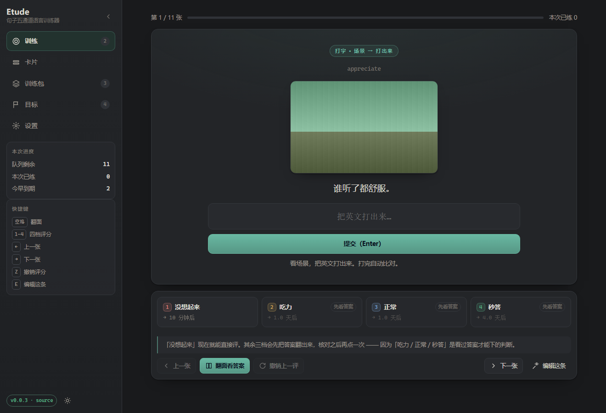
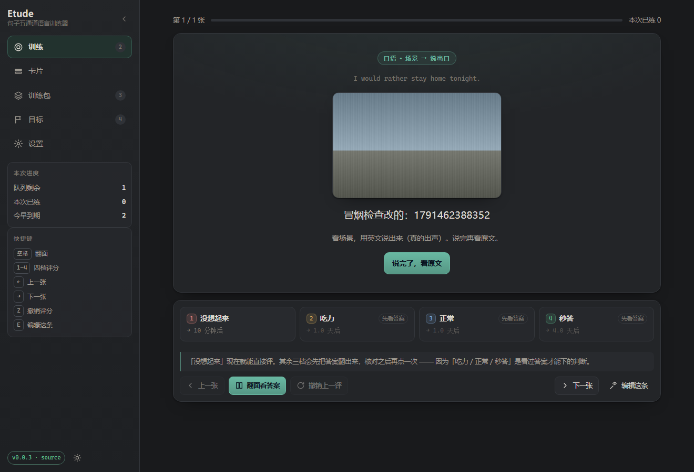
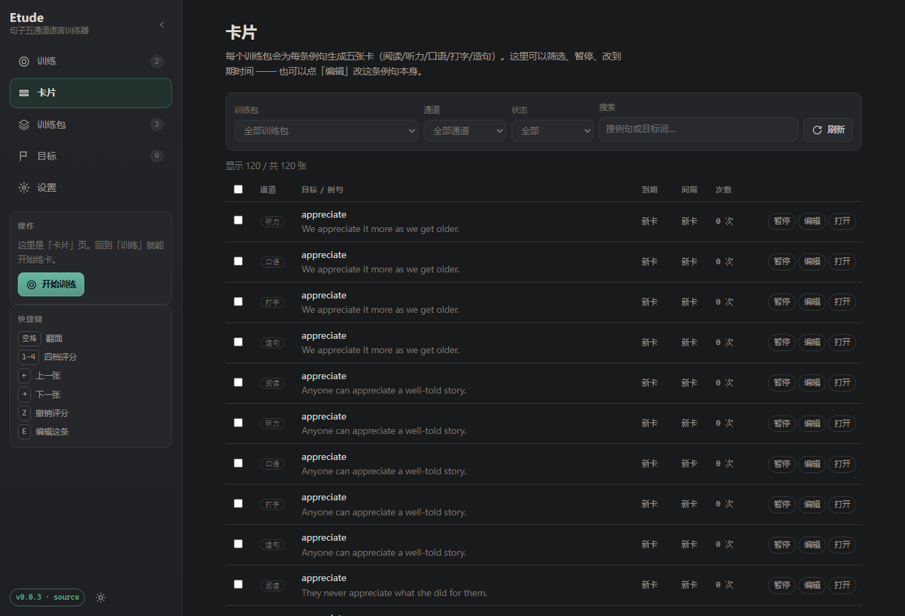
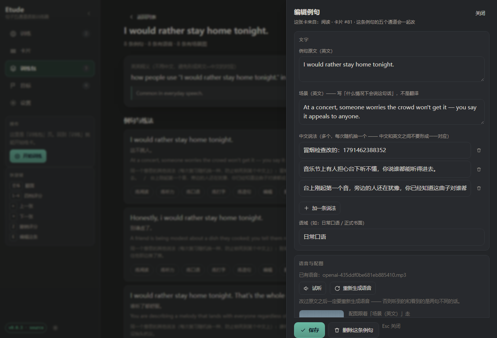
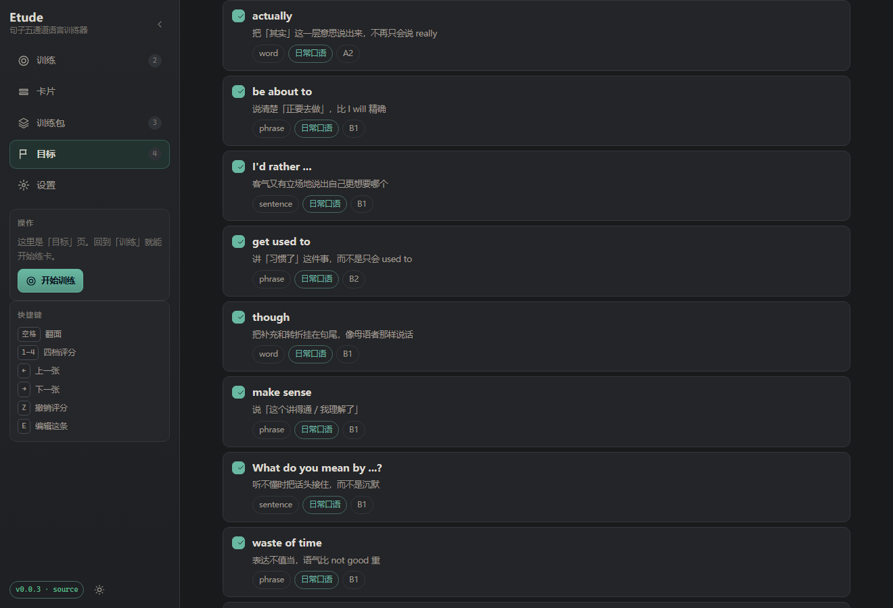
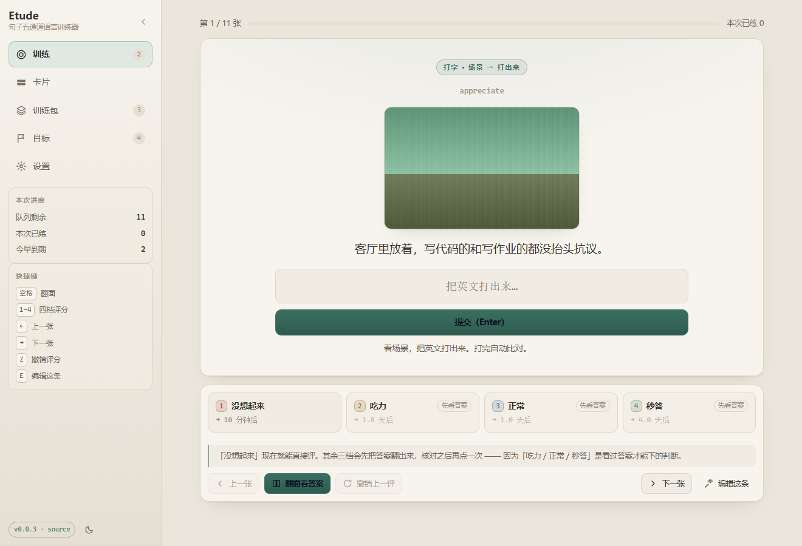
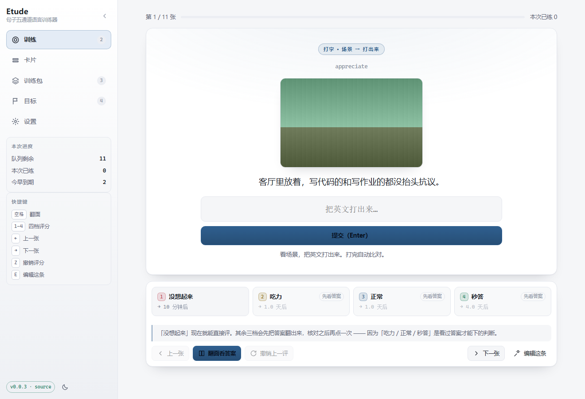

# Etude · 句子五通道语言训练器

> 一个把一句话练到「脱口而出」的本地工具。给它一个单词、短语或句子，
> 它生成一组**不同上下文**的例句，并把每一条铺成五种练法：阅读、听力、口语、打字、造句。
>
> 内容由大模型生成，语音由 Edge TTS 合成，复习进度存在你自己电脑上。
>
> *Etude*（/eɪˈtjuːd/）是音乐里的「练习曲」——**专为练技巧而写的曲子**，
> 不讲故事、不为演出，纯粹为了让手指形成本能。学语言是同一件事。

当前版本：**0.0.3**　·　目标语言：**英语**（其他语言见[路线图](#路线图)）

---

## 它和已有的工具不一样在哪

GitHub 上做「AI 生成语言卡片」的项目已经不少
（[mnemorai](https://github.com/StephanAkkerman/mnemorai)、
[han-flash](https://github.com/Baertig/han-flash)、
[anki_ai](https://github.com/gasparl/anki_ai)、
[anki-cards-ai-generator](https://github.com/ValeriiZhyla/anki-cards-ai-generator) 等）。

它们绝大多数是「**单词 → 卡片生成器**」——输入一个词，输出一张卡。Etude 不是一个造卡器，
它是一套**训练循环**，而且有几条明确的、和直觉相反的规矩：

| 常见做法 | Etude 的做法 | 为什么 |
|---|---|---|
| 一个词一张卡 | **一条例句五张卡**（听/说/读/写/造句） | 看得懂 ≠ 听得出 ≠ 说得出。合成一张卡等于假设它们能互相迁移。 |
| 卡片正面给中文翻译 | 正面给**场景**：「什么情况下会说这句话」 | 给逐字翻译的话，练习就变成了中译英——你在做翻译，不是在建立表达。 |
| 场景只有一行文字 | 场景可以是**一张图**（联网检索，或让模型画） | 「看到画面 → 冒出说法」比「看到中文 → 翻译成英文」更接近真实使用。 |
| 同一个中文解释反复出现 | 同一句话存 2~3 种**彼此不同**的中文说法，每次随机给一种 | 让大脑没法把英文锁死到某个固定中文上。 |
| 依赖 Anki + AnkiConnect（要先装插件、还得让 Anki 开着） | **自带训练器和间隔重复**，双击就能练 | 少一层依赖就少一处「配好了但没反应」。Anki 导出以后再说。 |
| 例句要你手动喂进去 | 给一个词，**自动生成 8 条不同上下文的句子** | 理论的要点是「用大量不同例子重塑连接」，凑例子是最费时间的一步。 |

这套规矩不是我编的，来自《学习观 07》——详细的理论到代码的映射见
**[docs/THEORY.md](docs/THEORY.md)**。

---

## 界面

<table>
<tr>
<td width="50%">

**训练页**：评分键就在卡片正下方，四档顺手点
<br>

</td>
<td width="50%">

**场景配图**：「场景」这一侧可以是一张图
<br>

</td>
</tr>
<tr>
<td width="50%">

**听力卡**：只听声音，中间不经过图片和中文
<br>

</td>
<td width="50%">

**打字卡**：看场景打出来，逐词标出差异
<br>

</td>
</tr>
<tr>
<td width="50%">

**卡片浏览**：能筛、能搜、能一次勾一批
<br>

</td>
<td width="50%">

**卡片编辑器**：简易档只给必需的东西
<br>

</td>
</tr>
<tr>
<td width="50%">

**同一处的进阶档**：摊开间隔 / 难度 / 暂停
<br>

</td>
<td width="50%">

**目标**：先出大纲，你勾掉不要的再开工
<br>

</td>
</tr>
</table>

### 三套配色，跟着光线换

| 暖白 · 护眼（默认） | 冷白 · 清晰 | 深色 · 夜间 |
|---|---|---|
|  |  |  |

「跟随系统」**不是第四套配色**，它只是把「用哪套」的决定权交给操作系统 ——
白天想要暖白、晚上跟着系统变深色，这个需求就靠它表达。字号还有三档（小 / 标准 / 大），
字号和行距一起变：护眼这件事里，把字放大一点往往比把背景调暗更管用。

---

## 手动调进度（Anki 式的灵活度）

默认的**简易**档不会把 SRS 数字摆到你面前 —— 新手看到的应该只有「下一张该练什么」。
但如果你知道自己想要什么，**进阶**档把它们全摊开：间隔、难度、到期时间、卡片 id，
侧边栏还会多显示已暂停的数量。切换在「设置 → 界面 → 界面密度」。

### 卡片页


能按训练包 / 通道 / 状态（新卡 / 学习中 / 已到期 / 已暂停）筛选，能按句子或目标词搜索，
能翻页。勾一批之后可以一起：**暂停 / 恢复 / 推后 1 天 / 推后 7 天 / 当作没学过**。

> 「推后」是从**各自当前的到期时间**往后推，不是统一设成「今天 + N 天」——
> 后者会把一张已经压了三周的卡和一张今天到期的卡抹平成同一天，
> 你攒了两周的间隔差就这么没了。

### 逐张编辑

卡片上点「编辑」打开抽屉，能改：原文、场景（中英）、语域、中文说法（增删改），
外加「重新生成语音」「重新生成配图」「手动贴图片地址」三条单独的入口。

**暂停**（Anki 里叫 suspend）也在这一档里。「今天不想看这一批」是真实需求：
暂停的卡不进队列，也不计入「今天到期」的数字。

### 改例句和加例句

训练包详情页里每条例句都有「编辑」和「删除」。

- **自己加一条例句**时，五个通道的卡片会**一起铺好**。只插例句不铺卡的话，
  你会得到一条「看得见但练不到」的例句：它出现在详情页里，点「练阅读」却什么都不发生。
- **删例句会连它的卡片一起删**。`cards.example_id` 允许是 0（整包级的卡），
  所以没法用外键约束 —— 这段级联是手写的。漏掉的话会留下五张指向不存在例句的卡，
  练习时直接空屏。
- 如果因为中途失败留下了「有例句没卡」的半成品，用「补齐卡片」补一次。
  它的语义是**补缺**：已经存在的卡一律不动，不会重置任何进度。

---

## 快速开始

### 方式一：下载 exe（不用装 Python）

1. 到 [Releases](https://github.com/whyao56/Etude/releases) 下载 `Etude-0.0.3-win64.zip`
2. **解压整个文件夹**，双击 `Etude.exe`
3. 打开后先去「设置」填大模型（见下一节）
4. 到「训练包」页，输入 `appreciate`，回车

> ⚠️ 不要只把 `Etude.exe` 单独拖出来运行。旁边的 `_internal` 文件夹是程序的一部分。

> 需要 Windows 10 1803+ / Windows 11。没有系统自带的 WebView2 时会自动改用浏览器打开，功能一样。

### 方式二：从源码跑

```bash
git clone https://github.com/whyao56/Etude.git
cd Etude/backend
python -m venv .venv && .venv/Scripts/activate
pip install -r requirements.txt
python run_etude.py
```

`--no-window` 只跑服务不开窗口；`--port 9000` 换端口；`--data-dir D:\etude` 换数据目录。

---

## 配置大模型

训练包的例句是模型生成的，所以**必须配一个模型**。选一家即可：

| 厂商 | base_url | 模型名 |
|---|---|---|
| DeepSeek | `https://api.deepseek.com/v1` | `deepseek-chat` |
| 通义千问（百炼） | `https://dashscope.aliyuncs.com/compatible-mode/v1` | `qwen-plus` |
| 智谱 GLM | `https://open.bigmodel.cn/api/paas/v4` | `glm-4-flash` |
| Kimi | `https://api.moonshot.cn/v1` | `moonshot-v1-32k` |
| 豆包（火山方舟） | `https://ark.cn-beijing.volces.com/api/v3` | 填你的**接入点 ID**（`ep-xxxx`） |
| OpenAI | `https://api.openai.com/v1` | `gpt-4o-mini` |
| 本地 Ollama | `http://localhost:11434/v1` | `qwen2.5:7b` |

在「设置」里选厂商（会自动填好 base_url 和模型名）、粘上 API Key，点「测试连接」。

**密钥只写在本机的 `%LOCALAPPDATA%\Etude\config.json` 里**，不上传、不进仓库、
也不会回传到界面（界面上那个输入框永远显示「已保存，留空表示不改动」）。

> **建议用指令遵循较强的模型。** 生成器要求严格 JSON 输出，并且对「场景不是翻译」
> 这条约束很敏感 —— 弱模型会偷懒给逐字翻译，那整套方法就退化成中译英了。

---

## 配置场景配图（可选）

「场景」这一侧可以带一张图。**默认就已经能用**，不需要任何密钥：

| 来源 | 怎么工作 | 花钱吗 |
|---|---|---|
| **检索 + 画图并行**（默认） | 两条路**同时**开跑，谁先给出合格的图就用谁 | 画图那条看你选的模型 |
| **只用开放图库检索** | 按场景去 Openverse 搜图，搜不到就换 Wikimedia Commons | 免费，不需要密钥，**需要联网** |
| **只用文生图模型** | 调一个 OpenAI 兼容的 `/images/generations` 画一张 | 看你选的模型（预置的智谱 CogView-3-Flash 有免费档） |
| **不要图** | 只用文字描述场景 | — |

**为什么默认是「并行」而不是「两个都等再择优」**：检索 1–3 秒、画图 8–25 秒，
差一个数量级。等两个都回来，等于把画图的慢**加**在检索身上 —— 那就不是并行了。
先到先得有个可解释的必然结果：绝大多数时候检索赢（你拿到的是真照片），
只有检索限流 / 搜不到 / 超时时画图才接上场。这恰好就是想要的优先级，
而且是「顺带实现的」，不需要额外规则。

想换成「让模型画」，在「设置 → 场景配图」里选一个预置厂商（智谱 / OpenAI / 豆包 /
自定义），填好就能用「测一张」当场试出来。

> 配图**只出现在「场景」这一侧**，听力卡上永远没有图 —— 这是方法本身的要求，
> 不是还没做。

---

## 五种卡片怎么练

| 通道 | 正面给什么 | 你要做什么 | 翻面看什么 |
|---|---|---|---|
| **阅读** | 英文句子 | 在脑子里出现场景。**不读出声，不想中文** | 场景描述（随机一种中文说法）+ 配图 |
| **听力** | 只有声音 | 直接进入场景。**中间不经过图片和中文** | 原文 + 场景，并再读一遍 |
| **口语** | 场景描述 + 配图 | **真的出声说出来** | 原文 + 语音对照 |
| **打字** | 场景描述 + 配图 | 打出英文 | 逐词比对：绿色对、红色错/漏、黄色多打 |
| **造句** | 原句 + 换词提示 | 换掉主语/谓语/宾语，造一个新句子 | 参考替换词和例句 |

> **配图只出现在「场景」这一侧，而且听力卡上永远没有图。** 这是刻意的：
> 听力卡要的是「声音 → 场景」，中间插一张图就把这条路断成两截了。

**快捷键**（训练页）：`空格` 翻面　`1` 没想起来　`2` 吃力　`3` 正常　`4` 秒答
　`←` 上一张　`→` 下一张　`Z` 撤销上一评

评分只影响**间隔**，不影响对错。评「没想起来」会让这张卡 10 分钟后再出现一次，
而不是推到明天 —— 当次会话里就该再遇到它。

**四个评分键就排在卡片正下方**（0.0.3 从侧边栏搬回来的）。评分键必须跟它要评的
那张卡在一起 —— 放在侧边栏时，眼睛要在页面两个角之间来回跑，
而这是每次翻面都要做一遍的动作。**没翻面之前也能点**：点后三档会先帮你翻面，
并提醒你是在核对答案 —— 而不是把键灰掉让你以为坏了。

卡片下面还有一排导航键：

- **上一张**　只回看，**不改任何数据**。想看一眼前一句再回来，不会发现自己的进度变了。
- **下一张**　跳过，**不计入「本次已练」**。逼人评分只会得到假数据，污染间隔重复的输入。
- **撤销上一评**　把这张卡退回队列，连那条复习记录一起删掉。

> **「撤销」为什么要把复习记录也删掉**：那张表是「今天已经练了多少」的依据，
> 程序靠它决定还放多少新卡。撤了评分却留着记录，你会莫名其妙地发现新卡配额被吃掉了。
>
> 撤销靠的是**评分前存的快照**，不是拿公式反推 —— 反推会因为浮点累积误差
> 导致「撤销之后进度变了」。老记录（0.0.2 之前）没有快照时**直接拒绝执行**，
> 而不是把卡清零：清零等于凭空毁掉你的复习进度。

---

## 两种建包方式

### 一、给一个词：立刻生成

输入一个单词、短语或句子，回车。程序判定它的类型，生成 8 条**不同上下文**的
例句，逐条配好语音和场景图。适合「我正在读的东西里遇到一个词」。

### 二、给一个目标：先排大纲，再批量储备

「目标」页回答的是另一个问题：**「我到底要学到什么程度」**。

先选语言（目录里列了 10 种，目前只有英语可用，其余会直说还没做），再选你拿它
干什么 —— 三档：

| 目标 | 程序怎么理解 |
|---|---|
| **真正学会这门语言** | 目标是听说读写认五条腿都站起来：能在真实情境里听懂、说出、读懂、写出。大纲要覆盖高频功能词、固定说法和句型。 |
| **应付一场考试** | 你填要考哪个（中考 / 高考 / 四级 / 六级 / 雅思 / 学术英语 / 托福 / 考研 / 商务…）。**考试预设只给一个 CEFR 范围当参考**，不会退化成背词表。 |
| **我自己描述** | 原样交给模型，比如「明年去澳洲打工度假，要能和房东、同事日常对话」。 |

> **为什么不做成「选个难度等级」？** 因为「过六级」和「真的会用」是两件事。
> 填「六级」是你需要过考试，不等于你要学会这门语言。程序里这是**两条不同的
> 提示词路径** —— 考试那条收到的约束里写死了一句
> 「一份『重要单词表』是一份失败的大纲」。

选好之后是**先出大纲、再由你决定**：

1. 点「生成大纲」→ 出一份条目清单，每条带着类型（词 / 固定说法 / 句型）、
   使用领域、CEFR band，以及**为什么值得学这一条**
2. 你勾掉不要的（比如「这个词我早就会了」）
3. 点「开始生成」→ 按你留下的条目一条条建训练包，进度实时显示

**不先看大纲就直接生成 20 个包，是浪费你的时间也是浪费模型的钱。**

---

## 数据、备份与恢复

所有东西都在 **`%LOCALAPPDATA%\Etude`**：

```
Etude/
├── config.json      设置和 API Key
├── etude.sqlite3    训练包、例句、卡片、复习记录
├── audio/           例句语音（按内容命名，重复生成不会存两份）
├── images/          场景配图（同样按内容命名）
├── logs/            自检结果和生成失败的记录
└── backups/         手动备份
```

- **换地方解压程序不会丢数据**，数据和程序目录完全分开。
- 「设置 → 备份数据库」会导出一个自洽的单文件备份。
  （不用复制主文件的方式：数据库开着 WAL，直接复制会丢掉还没落盘的部分，
  打开是好的、内容却是旧的。）
- **卸载** = 删掉程序文件夹 + 删掉上面这个目录。

### 数据攒多了可以搬到别的盘

音频每条约几十 KB，场景图每张几十到几百 KB，攒起来是会占地方的。
「设置 → 数据」里填一个目录，就能把**整个数据目录**搬过去：

```
D:\Etude        ← 填这个，点「把数据搬过去」
```

几条规矩，都是为了让这件事**不会把你的复习记录弄丢**：

- **复制成功才写指针。** 中途失败 = 什么都没发生，你还在原来的位置。
- **旧目录里的东西永远不自动删。** 界面上会明确告诉你「确认新的能用之后再自己删」。
- 那个记录「数据在哪」的指针文件（`bootstrap.json`）**永远留在平台默认位置** ——
  它就是要开的箱子的钥匙，跟着箱子一起搬走就再也找不到了。
- 搬完**要重启程序**才生效，界面会直接说，不会假装已经好了。
- 优先级是 `ETUDE_DATA_DIR` 环境变量 > 指针文件 > 平台默认。
  **环境变量锁住时，界面上的按钮会告诉你「按了也不会生效」** ——
  而不是让你按半天没反应。

---

## 出问题了怎么办

**第一站永远是自检。** 在命令行里跑：

```
Etude.exe --check
```

它会逐项告诉你：数据目录能不能写、界面文件在不在、数据库能不能查、
模型配没配、语音引擎在不在、窗口组件有没有。
加 `--check-deep` 还会真的连一次模型。

结果同时写在 `%LOCALAPPDATA%\Etude\logs\selfcheck.txt`。

| 现象 | 先看这里 |
|---|---|
| 双击没反应 | 命令行跑 `--check`。多半是少了什么，它会直说。 |
| 界面打开了但生成失败 | 报错里带着「下一步做什么」，照着做。常见的是密钥错（401）或模型名错（404）。 |
| 有例句但没有声音 | 训练包里点「补语音」。也可以换个音色再试 —— Edge 语音偶尔会短暂不可用。 |
| 版本号显示不对 | 大概率是端口上还留着一个旧进程。关掉所有 Etude 进程再开。 |
| 生成很慢或超时 | 8 条例句本来就要几十秒。可以在设置里调大超时，或换个更快的模型。 |

---

## 开发

```
etude/
├── backend/
│   ├── app/
│   │   ├── paths.py        ← 全项目唯一判断「是不是在 exe 里」的地方
│   │   ├── storage.py      ← 数据目录搬家（只写指针，从不删旧数据）
│   │   ├── prompts.py      ← 理论落到提示词的那一层（很重要）
│   │   ├── pipeline.py     ← 生成流水线（单包 + 学习计划）
│   │   ├── providers/      ← 大模型、语音、场景配图
│   │   ├── srs.py          ← 间隔重复（纯函数，好测）
│   │   ├── selfcheck.py    ← 自检
│   │   └── api.py          ← HTTP 接口
│   ├── frontend/index.html ← 单文件界面，零构建零依赖
│   └── tests/              ← 187 项测试
├── scripts/
│   ├── build_exe.py        ← 打包（带前置检查、归档核对、体积报警）
│   ├── make_release.py     ← 发版（算校验和、建 release、验证下载页）
│   ├── e2e_check.py        ← 对着打包版打真实 HTTP
│   ├── ui_smoke.js         ← 真浏览器里点一遍并收集控制台错误
│   ├── screenshots.js      ← 生成文档截图（README 的图就是它出的）
│   ├── cdp.js              ← 上面两个共用的一层 CDP 封装
│   ├── openai_stub.py      ← 本地假模型，**不用真密钥**就能跑通全流程
│   ├── products.py         ← 打包产物在哪（上面三个脚本共用这一个判断）
│   └── check_js.py         ← 前端静态守卫
└── docs/                   ← 见下面的文档索引
```

常用命令（在 `backend/` 下）：

```bash
python -m pytest tests/ -q          # 全部测试
python ../scripts/check_js.py       # 前端调用点 + 事件名检查
```

**不用真密钥跑通全流程**：开一个终端跑假模型，然后让 Etude 指向它：

```bash
python scripts/openai_stub.py --port 18999
# 设置里 base_url 填 http://127.0.0.1:18999/v1，密钥和模型名随便填
```

假模型还能模拟各种坏情况：模型名用 `fault-401` / `fault-404` / `fault-500` /
`fault-notjson` / `fault-fenced` / `fault-messy` / `fault-slow`，
用来验证错误提示有没有指向一个**能修好的方向**。

打包和发版：

```bash
python scripts/build_exe.py                    # 打包 + 归档核对 + 冻结态自检
python scripts/e2e_check.py \
  --llm-base http://127.0.0.1:18999/v1         # 对着打包版跑真实 HTTP
python scripts/make_release.py --check         # 只算校验和，不上传
python scripts/make_release.py                 # 真发版
```

打包时**不会覆盖上一份产物**：`dist/Etude` 已存在就写到 `dist/build2/Etude`，
再下次是 `build3`。上面三个脚本都会自动找**最近一次**的那份。
想清理就自己删 `dist/` 下的旧目录 —— 脚本永远不会替你删。

### 文档索引

| 文件 | 讲什么 |
|---|---|
| [docs/THEORY.md](docs/THEORY.md) | **理论 → 代码的逐条映射**，以及哪些功能是刻意没做的 |
| [docs/ARCHITECTURE.md](docs/ARCHITECTURE.md) | 目录地图、数据模型、不变量 |
| [docs/QUICKSTART.md](docs/QUICKSTART.md) | 三种跑法怎么选、排错从哪下手 |
| [docs/STATUS.md](docs/STATUS.md) | 这一版**没做什么、没验证什么**（诚实记账） |
| [docs/DEVLOG.md](docs/DEVLOG.md) | 每一轮：起点 / 怎么做 / 踩到什么 / 怎么验证 |
| [docs/releases/](docs/releases/) | 每个版本的发行说明 |
| [CHANGELOG.md](CHANGELOG.md) | 版本变更 |

---

## 路线图

- **已完成（0.0.1）** —— 句子五通道训练循环、间隔重复、语音、exe 打包
- **已完成（0.0.2）** —— 「场景」做成图（检索 / 文生图）、以目标为导向的学习计划、
  数据目录可搬迁、界面重做
- **已完成（0.0.3）** —— 配图「检索 + 画图」并行、修好大模型语音的音色取错、
  上一张/下一张/撤销、卡片与例句编辑（简易/进阶两档）、三套护眼配色、字号三档
- **0.1.x** —— 发音训练（跟读录音 + 对比）、训练包详情进地址栏（`#lessons/<id>`）、
  按主题批量建包
- **0.2.x** —— 导出 Anki 牌组（`.apkg`），不依赖 AnkiConnect
- **0.3.x** —— 加第二门目标语言（架构上只差提示词和音色表，见 THEORY.md 第四节）
- 更远 —— 从你自己的语料建包（字幕 / 电子书 / 播客）、多设备同步

---

## 已知限制（0.0.3）

- 只支持**英语**作为目标语言（语言目录里能看见其他 9 种，但会明确告诉你还没做）。
- 例句质量取决于你配的模型，程序不做质量校验。
- 发音打分**没做** —— 评分是你自己打的，程序不判断对错（打字卡除外，那是逐字面比对）。
- 场景配图的**检索质量**取决于开放图库。检索不到时会留空，不会塞一张不相干的图。
- **语速 / 音量设置在「大模型语音」下仍然静默失效** —— 现在只有音色是通的。
- 进训练包详情的地址栏仍然是 `#lessons`，**刷新会回到列表**（详情页有返回按钮，功能没坏）。
- 只在 Windows 上打包和验证过，没有 macOS / Linux 的桌面包。
- 没有多设备同步。
- **没有验证过真人长期使用效果。** 代码逻辑对着理论写了，但「照着练三个月会怎样」
  没有任何数据支持，也不应该被声称。

## 许可

[MIT](LICENSE)
